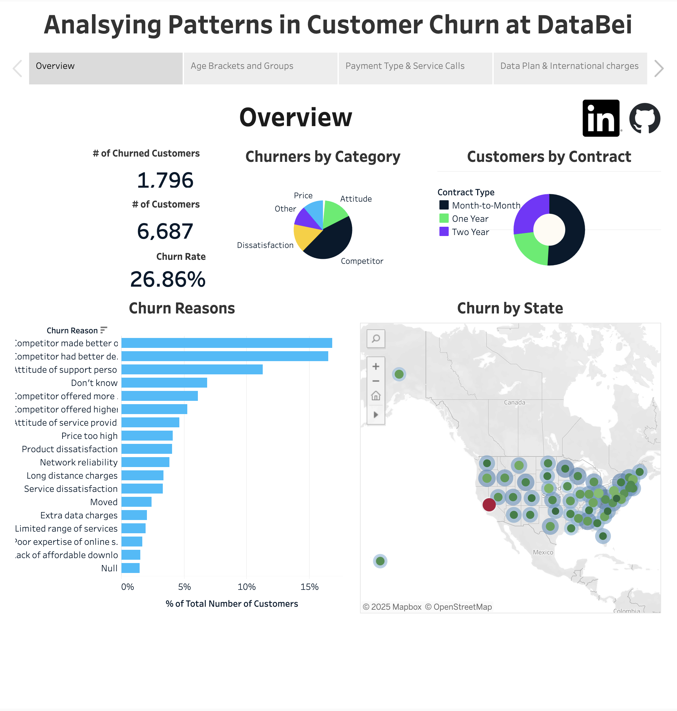
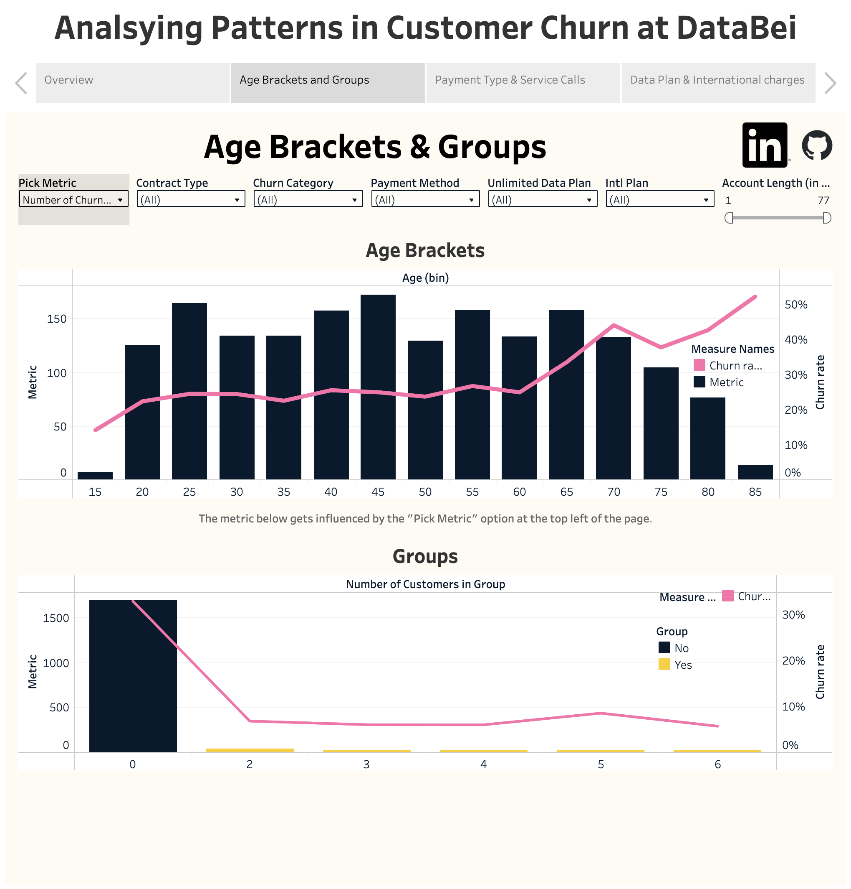
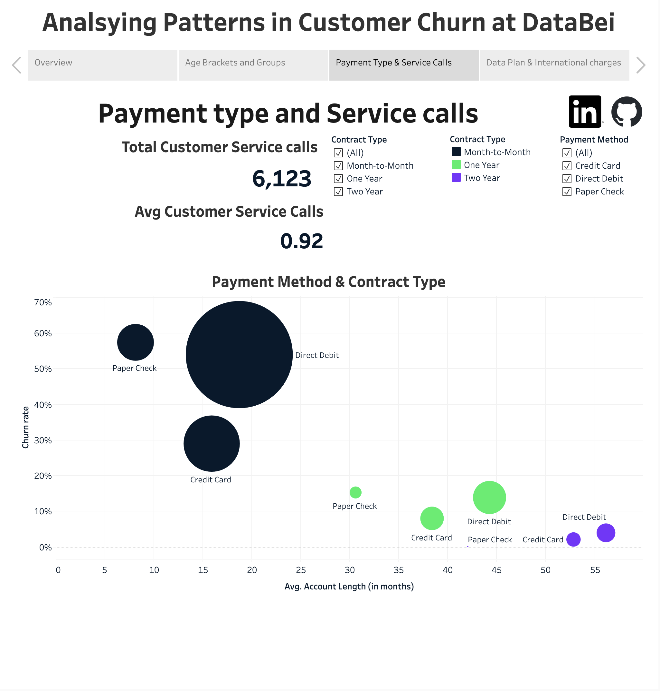
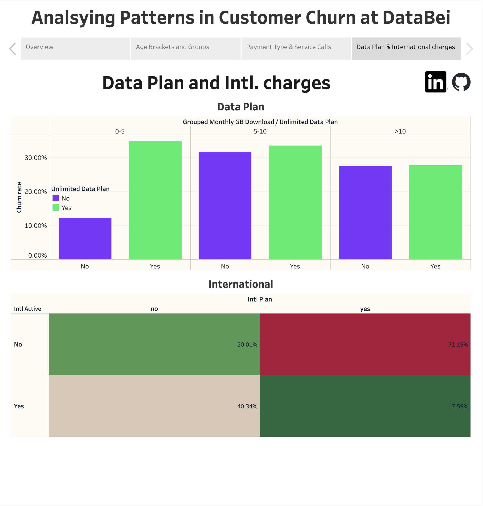

# 📊 Analyzing Customer Churn with Tableau 

## 🔍 Project Overview

This project uses Tableau to uncover the drivers behind customer churn in a telecom company, Databel, aiming to uncover insights about customer behavior. Understanding churn involves more than just knowing the churn rate; it requires identifying the root causes and devising strategies to reduce customer attrition. By leveraging Tableau's advanced features like calculated fields, dual-axis graphs, scatter plots, filters, and parameters, this analysis transforms raw data into actionable insights through compelling visual dashboards.

## 📁 Contents

- **[Tableau File](Customer_Churn.twbx)** – Tableau workbook with calculated fields, custom charts, and storyboards for churn analysis
- **[Data](Databel-Data.csv)** – Cleaned dataset including customer demographics, service usage, and churn labels
- **README.md** – You're here!
- **[Interactive Dashboard](https://public.tableau.com/app/profile/chiranjeevi.nalapalu/viz/Customer_Churn_17449891659040/Summary)** – Direct link to Tableau Public visualization

## 🌐 Live Dashboard

👉 [**View the Dashboard on Tableau Public**](https://public.tableau.com/app/profile/chiranjeevi.nalapalu/viz/Customer_Churn_17449891659040/Summary)

## 🛠 Skills Learned 

### Data Preparation
- Connecting to diverse data sources (Excel, CSV, SQL databases, etc.)
- Cleaning and transforming data using Tableau Prep
- Creating joins, unions, and relationships between datasets
- Handling null values and resolving data inconsistencies

### Data Visualization
- Designing dynamic dashboards and compelling stories
- Building custom charts like heat maps, treemaps, and scatter plots
- Applying interactive filters and parameters for tailored analysis
- Leveraging calculated fields for in-depth insights

### Advanced Analytics
- Performing Level of Detail (LOD) calculations
- Executing advanced table calculations
- Conducting trend and forecasting analysis
- Applying cluster analysis and regression modeling techniques

### Customization
- Crafting user-friendly layouts with intuitive designs
- Enhancing storytelling with custom colors, formatting, and tooltips
- Utilizing shapes, icons, and images to enrich visual narratives

### Integration and Sharing
- Publishing dashboards on Tableau Server and Tableau Online
- Automating data refresh schedules
- Embedding Tableau visualizations into external platforms
- Exporting dashboards to PDF, PowerPoint, and Excel formats

## 📊 Key Visualizations

### 📍 Overview
Visualization highlighting key KPIs from the study, including churn rate and number of churned customers. It also highlights the main reasons for the churning in a stacked bar chart and categories shown in pie chart. A map showing churn rates by state with a tool tip showing additional information. 

### 📍 Age Brackets and Groups
Interactive dashboard showcasing metrics distribution (e.g., service calls, customer count) across various age brackets and group numbers. Includes filters for payment method, international plan, account length, and more. 

### 📍 Payment Method and Contract Types
Scatter plot displaying churn rate vs. account length for different payment methods and contract types, enriched with text fields indicating total and average service calls.

### 📍 Data Plan and International Charges
Highlight table and grouped bar chart illustrating churn rates as a function of international charges and data plans.

## 🧠 Insights & Takeaways

- **Insight 1:** Total churn rate stands at 26.86%, with competitors offering better deals as the leading cause.
- **Insight 2:** California exhibits the highest churn rate, predominantly among customers on month-to-month contracts.
- **Insight 3:** Older customers are more prone to churn, whereas younger individuals and those in family/group plans show lower rates.
- **Insight 4:** Customers often churn when they subscribe to plans they underutilize, resulting in higher perceived costs.

## 💡 Future Improvements

- Enable drill-down capabilities for granular analysis
- Incorporate dynamic parameters to enhance interactivity
- Expand datasets to analyze longitudinal trends

## 📫 Let's Connect!

Feel free to reach out for feedback or collaboration opportunities:

- [LinkedIn](https://www.linkedin.com/in/nalapalu/)
- [Portfolio Website](https://www.datascienceportfol.io/nalapalu)
- 📧 Email: [chiran.nalapalu@gmail.com](mailto:chiran.nalapalu@gmail.com)

---

Thank you for exploring my Tableau project!

---
